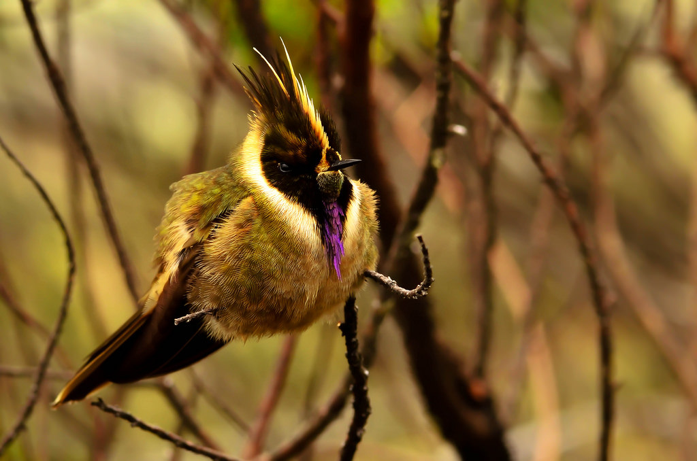

date: 2016-08-07 19:00
more:
template: article

# Making of Oxypogon.js, the static blog generator

Originally the idea of blogging and, afterwards, the idea of creating simple blogging system called _Colibri_ emerged in my mind back in 2009 year as far as I remember. Probably there was nothing interesting in my experience that days to share with anyone, but the idea itself seemed to be interesting (make a system from scratch) and useful (get a blogging engine as a result).



I started with just a blueprint in a form of written high-level description of the system and ended at the same point without any further development. Actually I didn't have enough motivation to write a blog and especially building a blog engine that time.

During those years I returned to the idea a few times: created some versions of this site (sometimes I will definitely find them all and publish in the archive) and wrote some articles, maintained a [livejournal-based blog by the name of rawgift](http://rawgift.livejournal.com/) in Russian. But all of those attempts failed for some reason resulting with no blog that had sustained for a while.

Years later, in the early 2015, I created the first version of this blog using a [bunch of gulp-based scripts](https://github.com/oleggromov/oleggromov.com/tree/613fb2c6cb626f8bed88c5831bbf341f87317e65). Gulp was very familiar to me and in fact the only well-known Node.js utility. The biggest gulp task looked like this:

```
gulp.task('index', function() {
	var previews = require('./helpers/previews').getList;
	var articles = [];

	var menu = _.cloneDeep(menuGlobal);
	menu[0].active = true;

	var options = _.cloneDeep(jadeOptions);

	gulp.src('src/content/articles/**/*.md')
		.pipe(previews(articles))
		.pipe(data(sortAndBuild));

	function sortAndBuild() {
		var sortedArticles = _.sortBy(articles, function(article) {
			return -(new Date(article.date));
		});

		gulp.src('src/page/articles/index.jade')
			.pipe(jade(_.assign(options, {
				locals: {
					articles: sortedArticles,
					menu: menu
				}
			})))
			.pipe(gulp.dest(to + 'articles/'));
	}
});
```

And the remaining code was more or less like a mess of configuration, ambiguous gulp plugins' calls mixed with file paths and weird processings of the intermediate data being in an unpredictable form and state — connected all together by gulp piping. I decided to take some parts away by moving the processing functions into `helpers/` directory to add some accuracy and tidiness. This helped a little. I just got files like `helpers/previews/index.js`:

```
var through = require('through2');
var meta = require('../meta');
var _ = require('lodash');
var path = require('path');
var markdown = require('../markdown');

module.exports.getList = function(previews) {
	return through.obj(function(file, enc, callback) {
		if (file.isNull()) {
			callback(null, file);
			return;
		}

		if (file.isStream()) {
			callback(new gutil.PluginError('pipe-article', 'Streaming not supported'));
			return;
		}

		var source = file.contents.toString();
		var articleMeta = meta.extract(source);

		var preview = _.pick(articleMeta, [
			'date',
			'more'
		]);

		var filePath = path.dirname(file.path);
		preview.url = filePath.replace(file.cwd + '/src/content', '') + '/';
		preview.preview = markdown.getPreview(source);
		preview.title = markdown.getTitle(source);

		previews.push(preview);

		callback(null, file);
	});
};
```

Which in turn was messy, required other helpers and, even worse, obscure modules and checks in code required for any gulp plugin to work. This was a hell in essence but it helped me to build first quite modern version of my blog, publish it and forget about the idea and its terrible realization for year.

## Stop! Why not existing solutions like Docpad, Hexo?

Certainly I've heard about existing static blogging engines. The first I've heard about was [_Docpad_ described in Sergey Chikuyonok's article](http://chikuyonok.ru/2013/02/docpad/) (in Russian). Sergey tells about configuring Docpad and setting up needed plugins to generate menu and assemble static files with _grunt_.

I don't actually remember the reasons to refuse Docpad usage. Now it seems to be rather similar to Oxypogon. But looking at the documentation and [begginer's guide](http://docpad.org/docs/begin) I guess the complexity was the reason to throw away the idea of using Docpad. Is uses complicated abstractions like blocks, collections, discourages you with many different plugins and unclear building steps... Stop! This seems to be kind of fault finding that is definitely not in list of my goals. The only thing I'd like to illuminate is the complexity of Docpad's realization over the simple and powerful idea of processing markdown sources to static HTML files combined with some CSS and Javascript.

Ultimately I dropped the idea of using Docpad in favor of the mentioned above bunch of gulp plugins. Not too wise decision, isn't it?

The next candidate for building my static dream website with a blog was _Hexo_. I've heard about it before but never tried. Once the time has come and I started a new iteration of looking for an engine I've found the [list of static site generators on somebody's github](https://gist.github.com/davatron5000/2254924) and started to try them. I found _Blacksmith_, _Wintersmith_ a few other _something-smiths_ but all of them failed to work for some reason. I just created a temporary folder `/tpm/blog`, installed another one generator and in 5 to 10 minutes removed it forever because of unclear behavior in some case.

Then, lost in the comments below, I found Hexo. Compared to other projects it was well-maintained, had a few thousand stars on github and was documented in detail and in a friendly manner. I definitely gave it a try that day but eventually thrown away even it despite its documentation and community. Maybe I've already had my own vision of working with a statically assembled website or just have got tired of seeing into unfamiliar technologies... Who can remember now.

After all these tries and in a year and a half passed I returned to the idea of building my own static site generator. I called to memory those _Colibri_ blueprints and found the idea to still be of my current interest.

## First publication

Oxypogon's history is tightly coupled with my website's story. I tried to write something useful (or just for fun) a few times and all those times I failed to proceed for some significant amount of time. The last publication happend one year later, on February 2016, when I [finished some scripts, made a mobile-friendly version, wrote the first article](https://github.com/oleggromov/oleggromov.com/tree/dd94f46a99db0fc38d1d0320022c3092d95c69b2) and published this mess as a website.

The [incomplete second article about IE postMessage-ing between tabs and windows](https://github.com/oleggromov/oleggromov.com/blob/dd94f46a99db0fc38d1d0320022c3092d95c69b2/src/content/articles/ie-postmessage-between-windows-and-tabs/index.md) was also published by mistake — but was never finished. Eventually I decided to delete it insted of finishing. If you're interested in the subject please drop a line in comments and we'll have a discussion on the topic. Maybe I can help.

Unfortunately there was no croud roaring and celebrating the first publication. Only the collegue of mine from Yandex [Ivan Bessarabov made a PR adding RSS support to the ToDo list](https://github.com/oleggromov/oleggromov.com/pull/1). Thank you, Ivan, for the contribution and concernment about my facility! [Your wish is still on the Oxypogon's todo list](https://github.com/oleggromov/oxypogon/tree/f7748036c0e00ee39142ba884d9ed41640c8bb24#todo) and I hope I can fulfill it soon as the new arcitecture of the system makes adding such additions painlessly without any significant effort.

## Transition to procedural-modular version


## Eventually well defined system built on classes

## Naming

As was mentioned above, initially I found “Colibri” fitting my idea of simple and lightweight engine very well as it's known its tiny little size and startling wing swinging speed. Eventually this name proved to be taken at least on the npm registry and I decided to change it.

Next I found a list of different humminbirds on the Wikipedia (I won't share it with you because there're too many perfect names for my further projects), chosen the most severe and a bit grumpy one (I think it a bit like me) and named the project in honor of it. **Oxypogon!** I guess it should be pronounced as “aksi-pa-gen” or something similar, but I'm not sure. Furthermore Oxypogon is a very beautiful bird (you can see its picture at the top) and I humbly hope my code to be of the same quaility ultimately.


## Future plans and current flaws