date: 2017-02-26
written: 2017-02-26
more: Читать дальше про климат, людей, цены, язык — с картинками
template: article_covered
cover: images/la-palm-trees.jpg
coverColor: #818fac

# Первая неделя в Лос-Анджелесе

В начале прошлой недели я *переехал* в Лос-Анджелес, чтобы учить английский — на полгода, если следовать первоначальному плану. Цели перебраться сюда (в США) насовсем у меня не было и нет, но мысли такие, разумеется, проскакивают. В мечтах, взявшихся преимущественно из сериала Californication и отчасти из поп-культуры вроде клипов и маек из Pull & Bear, Лос-Анджелес представлялся райским местом. Мегаполис с вечным летом, на берегу океана, в Южной Калифорнии. На деле всё оказалось, естественно, не совсем так.

Лос-Анджелес (а точнее весь округ, LA County) очень большой, размазанный по побережью и предгорьям. Живут тут преимущественно в частных домиках, как и везде в Америке (это вам не Манхэттен!). Все ездят на машинах. Людей на тротуарах нет! Конечно, есть подходящие для пешеходов островки жизни, но их я пока нашёл всего несколько штук. Скамеек на улицах нет, сидит народ только в уличных кафе, но и тех на улице раз-два и обчёлся. Не Италия.

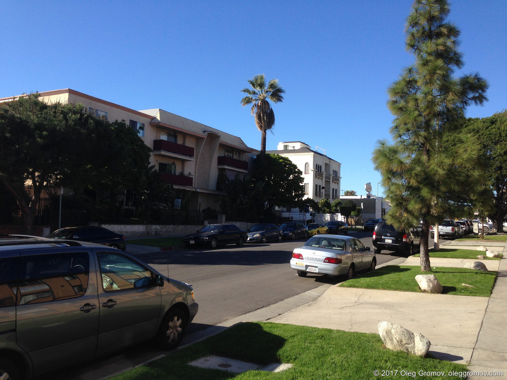
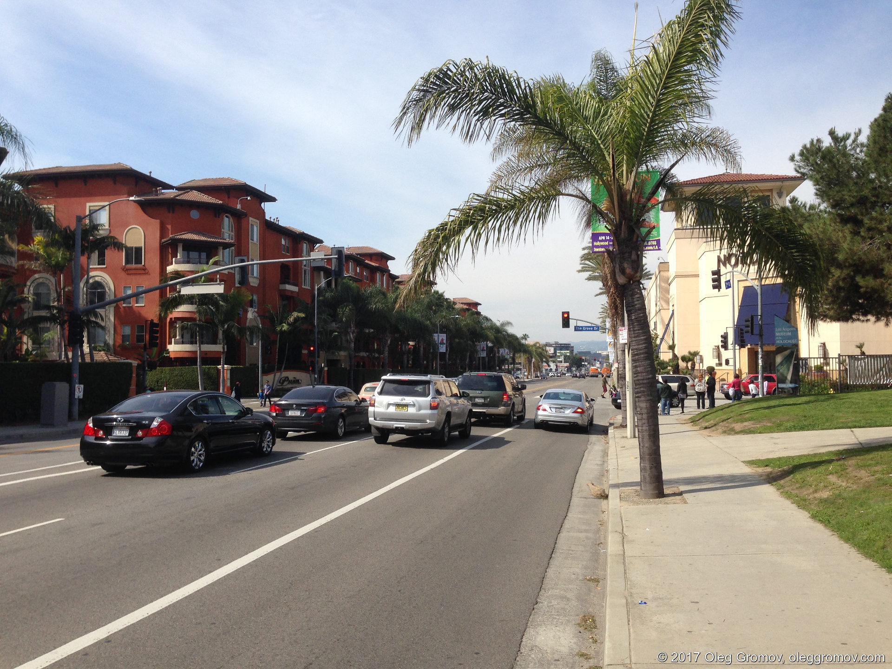

Транспорт (автобусы, метро) тут есть, но он феерически медленный. В метро можно ждать поезда минут 10, при этом пользуются им очень подозрительные личности. Стоишь на платформе и думаешь, не прибьют ли тебя ненароком. Ощущение захолустья, такое было только в пригороде Бостона, откуда я уезжал фактически на электричке. А здесь это в центре города.

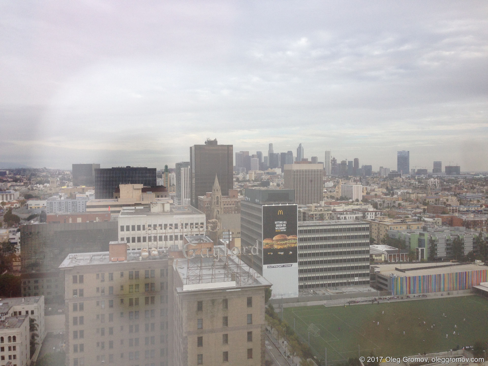

Что касается центра, то его нет. Есть Downtown Los Angeles, но я там ещё не был. Судя по отзывам, это кучка небоскрёбов, среди которых бродят бездомные да редкие пешеходы от машины в офис и назад. Расстояния при этом конские. Ехать из аэропорта LAX до DTLA на автобусе в обычных условиях около часа, может быть 1:20. Все реально ездят только на машинах. Это стоит учитывать при планировании поездки. Uber и Lyft вам в помощь.

## Климат

Климат кажется отличным, в феврале, не самом тёплом в истории LA, тут +13-20 и светит солнце. Пару раз был дождь, да и чёрт с ним, это даже хорошо для большого пыльного города. Летом, говорят, дикая жара. Пока ехали в машине на хайкинг с преподавателем из моей школы, я поджарился. Ну и после визита в Санта-Монику и Venice (это такой райончик у пляжа с пародией на каналы настоящей Венеции, переводить это название язык не повернётся) лицо сгорело.

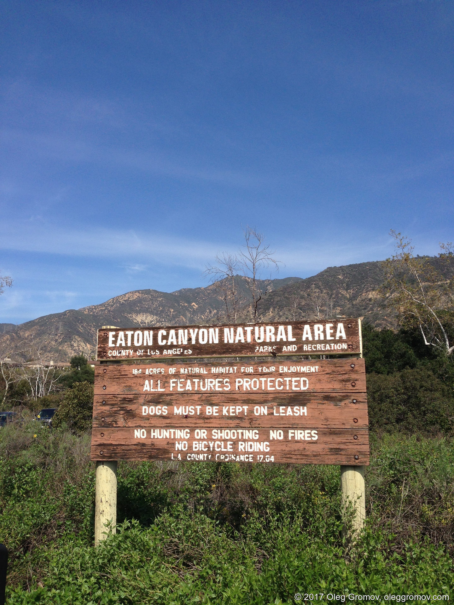

Океан производит впечатление! Волны громадные. Т.е. обычные морские волны, прибиваемые к берегу и назад, но больше в несколько раз. Внушительно. Купаться не пробовал и не полезу пока что :-)

Санта-Моника тоже хороша. Чистенько везде и ухожено, пальмы, лужайки, океан, дорожки красивые, много людей прогуливается в сравнении со всеми этими даунтанами. Там есть популярная велодорожка вдоль береговой линии, длиной, кажется, миль 20. Все пляжи в Калифорнии государственные (или муниципальные, в общем, открытые для публики). Оценить пляжную жизнь пока не удалось, т.к. холодновато всё-таки, но в пляжный волейбол играют даже сейчас.

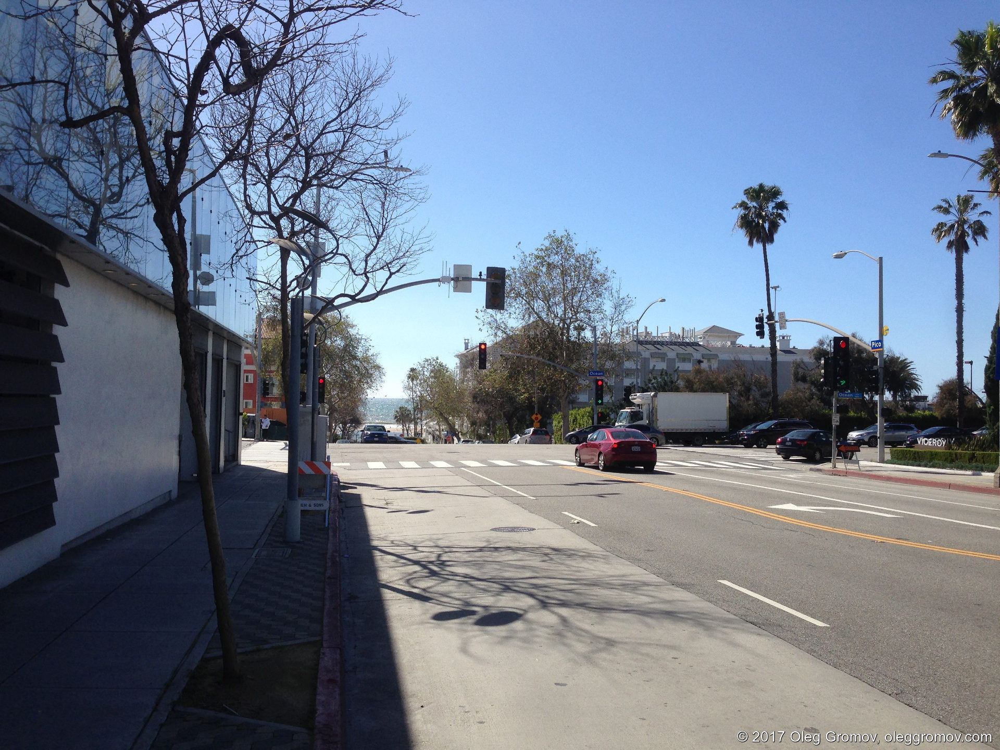
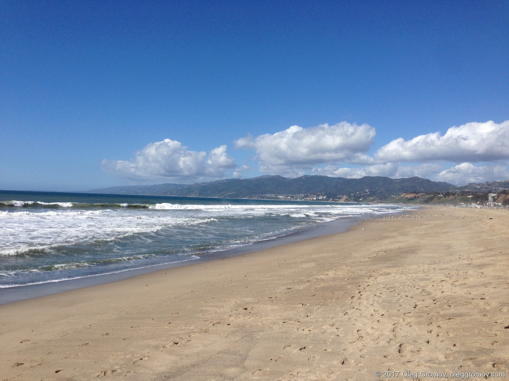
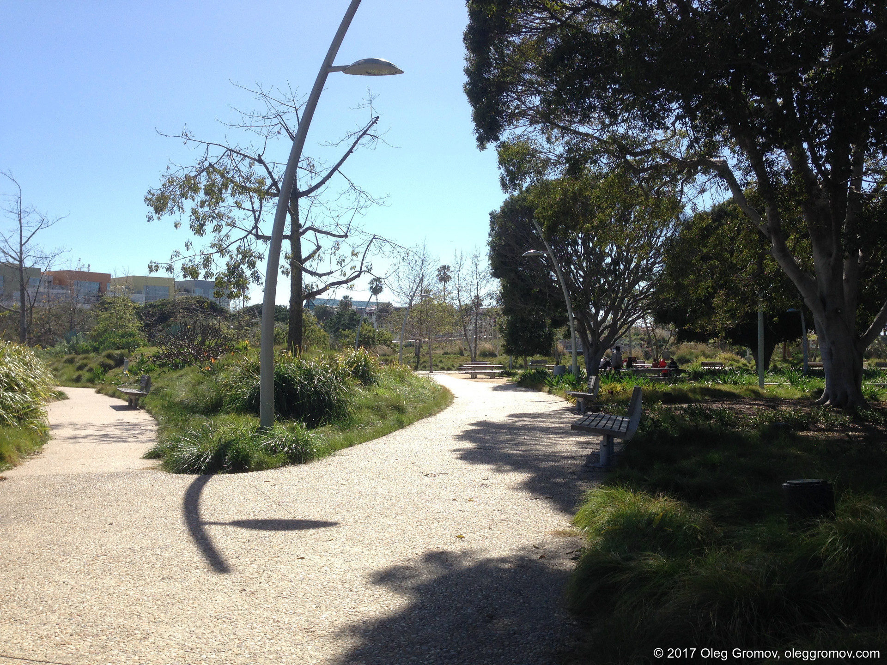

Дышится тут легко, хотя про Лос-Анджелес пишут, что над городом висит шапка смога, не пропадающая из-за малого количества осадков почти круглый год. Дымку я может быть и заметил, но воздух тут явно намного лучше, чем в Москве. Наверное близость океана всё-таки что-то даёт.

Вода хорошая, после душа не хочется потереться наждаком, как в Ростове-на-Дону. Впрочем, в Москве была не хуже.

## Люди

Конечно, в любом месте самое главное — это люди, с которыми проводишь время. Мне, кажется, повезло, т.к. в Columbia West College все очень дружелюбные. На первом занятии, где рассказывали о правилах школы, сын основателя школы Джеф называл всех нас храбрыми, т.к. поехали на другой конец света учиться английскому, а ещё рассказывал о своём отце Докторе Ли, который основал школу 20 с чем-то лет назад.

Я живу в Корея-Тауне, это географически примерно центр, но от центра, как я уже писал выше, ничего нет. Есть островок цивилизации с кафешками, офисами и магазинами вокруг Equitable Building, местечковые уголки с кафе-прачечной-магазинчиком — вот и вся цивилизация. Делать на улице решительно нечего, по крайней мере, у меня в Корея-Тауне! Привет, Наташа, ты конечно же была права.

На улицах, причём во вполне пристойных местах вроде парков или обыкновенных тротуаров есть целые палаточные городки. Там живут, как я понял, преимущественно druggies и прочие алкаши. К ним я стараюсь не приближаться, чтобы не огрести проблем — много раз слышал об их агрессивности. Очень жаль, что отличные парки могут быть опасными из-за этих бомж-пати. Разгонять их никто не собирается, либо они ловко перемещаются.

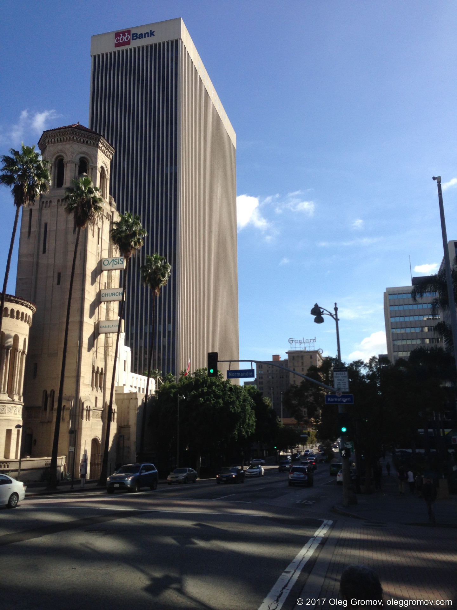

В первый же день в метро со мной познакомился фотограф Джеф, который оказался геем, много рассказывающим об опасности Лос-Анджелеса и «crazy people» Америки, которые только и хотят денег и славы. Фотограф он явно неплохой, в прошлом был моделью и хвастался кучей фотографий, но уж очень болтливый на все подряд темы, а ещё явно заинтересованный во мне. Не то чтобы меня это пугает, человек-то добрый, тратил своё время, но это явно задаёт неподходящий тон нашему общению.

Джеф был не единственным, кому приглянулись мои оранжевые кроссовки. Я несколько раз ловил улыбки и комплименты вроде «liked your shoes, by the way» на улице или в кафе.

Из школы, кроме самих преподавателей, очень доброжелательны и студенты, и даже Боб, муж Патрисии, одной из преподавателей. Они живут недалеко, он гоняет на велике и между делом, когда выдаются сложные дни, помогает жене, а на самом деле студентам с оформлением банковских счетов, покупкой мобильных номеров и льготных Tap Cards — это проездные для местного метро и автобусов. Помог и мне, потратив на меня час своей жизни. Большое спасибо, Боб!

На вводном занятии кроме меня оказалось 4 человека, говорящих по-русски. Двое русские, один парень собирается стать актёром, другой программист, который замучился менять языковые школы, чтобы оставаться в США легально. Говорят, «учиться» в школе — это самый простой и дешёвый способ сохранять легальный статус, чтобы не быть депортированным, правда работать официально нельзя. Ещё двое ребят из Казахстана. И это из 15 человек. Прям повезло!

Много ребят из Кореи, несколько человек из Таиланда, из Бразилии, девушка из Колумбии и девушка из Японии. Очень многонациональный состав. После хайкинга пошли поесть с тремя ребятами из Кореи. Все они выдумывают себе англоязчные имена (меня от этого отговаривают преподаватели, т.к. произносить Олег американцам несложно), потому что их имена выговорить почти невозможно — много горловых звуков. Фил, лучше всего владеющий английским, живёт здесь не первый месяц и работает официантом. Джуну всего 20 лет, он собирается поступать в университет и учиться на программиста. Самый интересный персонаж — это Клэр, кореянка, которая занималась полупроводниками и разрабатывала какую-то из микросхем для 6-го айфона у себя на родине, а здесь учит язык и занимается флористикой. К сожалению, т.к. английский она знает очень плохо, расспросить её подробнее не удалось.

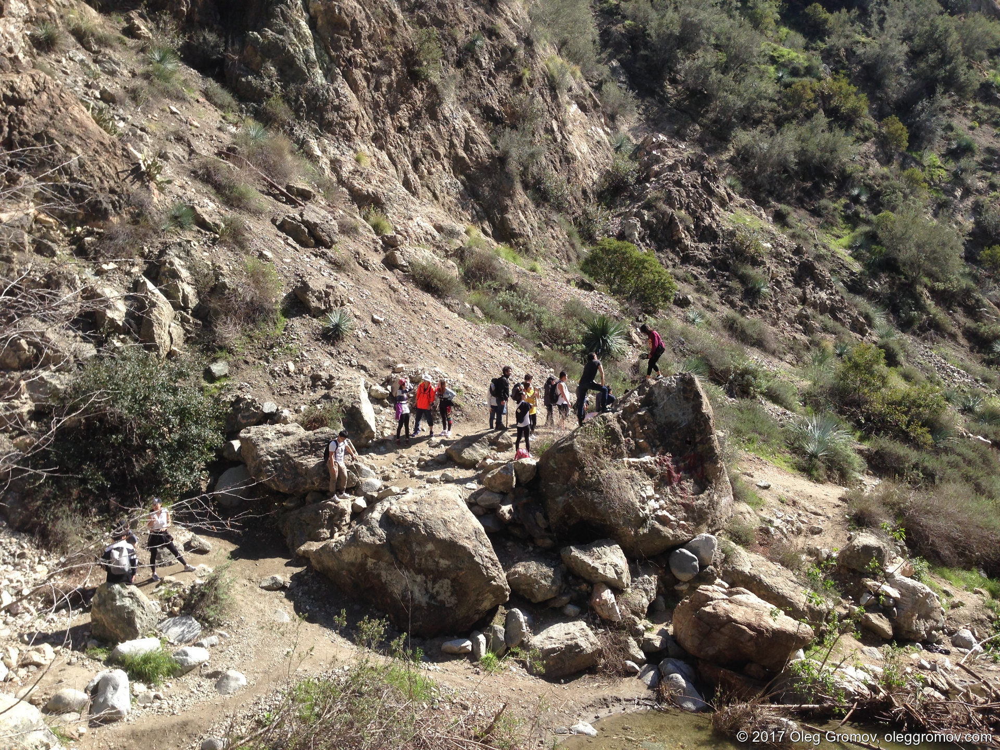
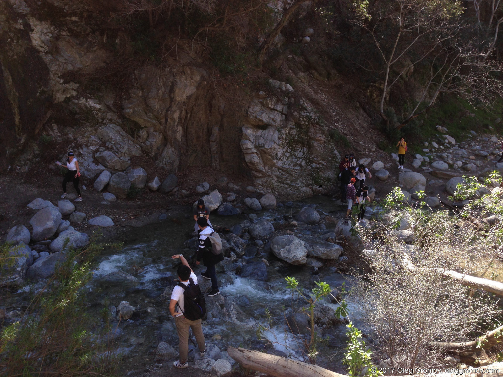

Вечером увидел, как какой-то парень из соседнего дома выкидывает Mac Pro старого образца. Подошёл спросить, почему он не хочет его продать и оказалось, что ему, по сути, лень — это не целый компьютер, а просто корпус с блоком питания, который он мог бы продать баксов за 80, но, виидмо, не хочет заморачиваться. И платить $20 за утилизацию тоже не хочет. Узнав, что я занимаюсь фронтендом, предложил обменяться контактами, чтобы сделать что-нибудь вместе.

На улице, не считая бомжей, и во всяких магазинах-кафе люди очень дружелюбные, стараются помочь. Если кто-то из людей как-то пересекается с тобой, то тут же улыбается, извиняется, заводит какой-нибудь незначительный разговор (вероятно, это то, что тут называется small talk). Ну и просто улыбаются больше, это правда.

## Цены

Жить в США и, видимо в особенности в Калифорнии, дорого. Конечно, играет роль курс доллара, но тем не менее. Обучение в школе стоит $700 в месяц при оплате за целый модуль (3 месяца). Это наверное самая небольшая из постоянных трат.

Жильё, маленькая комнатушка с короткой кроватью, столом, тусклой лампой и окном в миниатюрный двор-колодец, обошлось в $850 за месяц + $200 «security deposit» и «cleaning fee» + $50 за постельное бельё из икеи. И это один из самых дешёвых вариантов размещения, если говорить об отдельной комнате. Тем не менее, жить там ужасно неудобно, и я буду искать что-то побольше и посветлее. И, само собой, дороже. Порядка $1000-1200 в месяц. Коммуналка (utilities по-местному) включена в оплату таких комнатушек, возможность краткосрочной часто аренды тоже, что радует. Я студент, и никакой кредитной истории у меня нет, так что снять полноценную квартиру будет сложнее.

Мобильный телефон обойдется в месяц в $50-100 (я знаю только про предоплатые тарифы), обслуживание дебетовой карточки и счёта — в $12/месяц, либо держи весь месяц не меньше $1500 на счету.

Проезд в метро или автобусе стоит $1.75, для студентов то ли $1, то ли $1.25 — узнаю, когда получу студенческую карточку. Парковка порядка $1 в час. Т.к. без машины тут делать нечего, я всерьёз рассматриваю возможность получения местных прав и покупки авто, а скорее мотоцикла. Подержанную пристойную тачку можно купить за $2000-5000, но насколько это корыто будет пригодным для езды я не знаю, это только теория. Бензин стоит несколько баксов за галлон, не помню.

Бутылка воды 1,5 литра — около $1. Кофе в старбаксе или какой-нибудь похожей кофейне $3-4. Обед в кафешке около $10, в ресторане $30-40 плюс налоги и чаевые (не забывайте, в Северной Америке принято оставлять на чай 10-20 %). Банан — 19 центов в Trader Joe’s, магазинчике с неплохими продуктами. Набор полотенец, большое и маленькое, стоит баксов 20. В общем, всё сильно дороже в пересчёте на рубли, но вполне доступно по сравнению с местной нормальной зарплатой. Минимальная почасовая ставка — $20, по словам Алекса, препода из школы. Жить можно с таким, я полагаю.

Налог в Калифорнии, в зависимости от города, от 7,5 до 10 %. Это сверху к цене покупки, как везде в Америке.

## Язык

На предварительном тесте я набрал 6-й из 7 уровень по грамматике, и 5/7 по чтению/письму и слушанию/говорению. И в тесте, и в реальной жизни моя самая большая проблема в ежедневной болтовне в магазинах кафе — это то, что я не слышу, что говорят. Буквально, мозг не воспринимает незнакомые слова как слова и не выделяет их из шума окружающей среды. Когда люди говорят простые вещи, либо я уже много раз слышал эти фразы, это элементарно распознаётся.

В тесте было сложно разобрать некоторые предложения на слух, т.к. в кабинете было много других людей, а следовательно, шумно. Но это, повторюсь, абсолютно реалистичная ситуация.

Второе, связанное с говорением, это то, что у меня очень маленький разговорный словарь. Я говорю очень простыми фразами, к которым привык, а когда пытаюсь объяснить какие-то более сложные вещи, то тут же теряюсь. Я не представляю сейчас, как можно хорошо выучить язык на том же уровне, что и русский — это такой громандный объём информации, ситуаций, разнообразных конструкций. Сложно представить!

Ещё неудобство в том, что иногда я неправильно произношу слова. Преподаватели к этому обычно готовы, могут и объяснить и поправить, и просто продолжить общение как ни в чём не бывало. А вот в реальных разговорах мешает, часто переспрашивают, т.к. я что-то там невнятно себе пробурчал.

## Мелочи

Приятно порадовала прачечная. Загружаешь в стиралку 1 доллар 25-центовиками, о которых я писал выше, кладёшь бельё, ждёшь 45 минут — постирано, всё как всегда. Кроме того, что надо было разобраться, где брать 25-центовики: оказывается, их выдают при так называемом cash back в супермаркетах (это когда вместе с оплатой картой ещё списывается выбранная на терминале сумма и выдаётся тебе налом) — можно попросить 10-долларовую упаковку и использовать.

Но самое главное — сушильная машина. Не знаю, подойдёт ли она для всех вещей, но для моих джинсов-маек-полотенец идеально! Тот же доллар, те же 45 минут, и вещи сухие. Я думал, придётся гладить, но нет, даже лучше, чем после привычной сушки на воздухе, нет никаких складок. Почему мы в России так не делаем? Очень удобно!


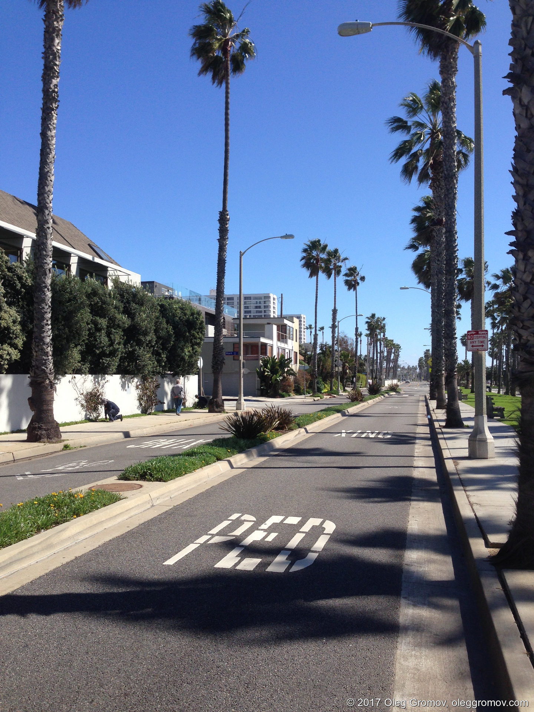

Ещё американцы безумно любят аббревиатуры. Кроме банальных и относительно известных даже россиянам LA (Los Angeles), NYC (New York City, потому что есть ещё штат Нью-Йорк), DTLA (Downtown Los Angeles, уже не так банально, да?), есть всякие SoHo, NoHo (причём в Нью-Йорке это обозначает South и North Houston, а в LA South и North Hollywood), WeHo, SoCal, NoCal (угадайте с трёх раз, что это) и король вечеринки — фраза «Peds Xing», встречающаяся на дорогах. Не совсем аббревиатура, но впечатляет, правда?

## Общее впечатление

Самое главное, что я понимаю, так это то, что идея переехать куда-то, не будучи знакомым с языковой и культурной средой и не имея там друзей или знакомых — это настоящее безумие. Кроме обычных проблем, с которыми столкнётся переезжающий носитель языка, вроде изучения города, поиска любимых мест, людей для общения, у переезжающего вроде меня будут проблемы с самим миром — языковой и культурный барьер, просто шок от обилия нового.

Настроение тут скачет от «твою мать, что я тут забыл, где взять дурацкие 25-центовые монетки, чтобы постирать!» до «офигеть, я почти в Голливуде, это же пальмы, Санта-Моника, вечное лето!».

Интересно, конечно же, что оставшись наедине с собой, возвращаешься к прежним проблемам. Представьте себе ленивую субботу, когда просыпаешься около обеда, дома нечего жрать, идти никуда не хочется, лень. Чем заняться? Как с кем-нибудь познакомиться? Зачем, самое главное? Где пожрать? Блин, надо постирать вещи… Вылезают все комплексы и проблемы, которые очень удачно прячутся под размеренной жизнью на родине.

И, конечно, становится понятно, что недостаточно жить где-то. Надо ещё и быть кем-то, хотеть чего-то, заниматься чем-то. И недооценить важность любой из этих составляющих — это как заставить себя пропрыгать марафон на одной ноге, вместо нормального подготовленного прохождения дистанции на двух ногах.

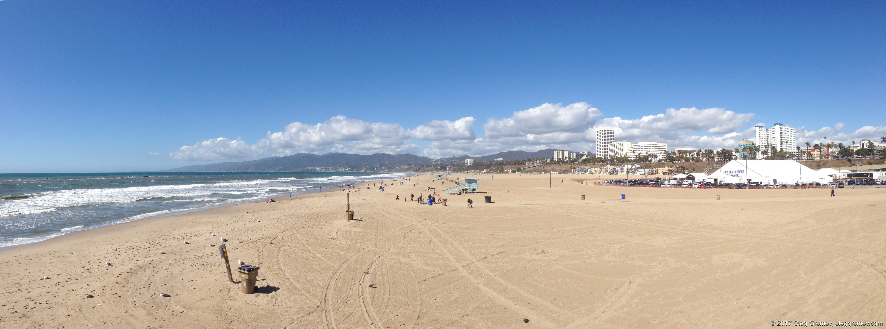